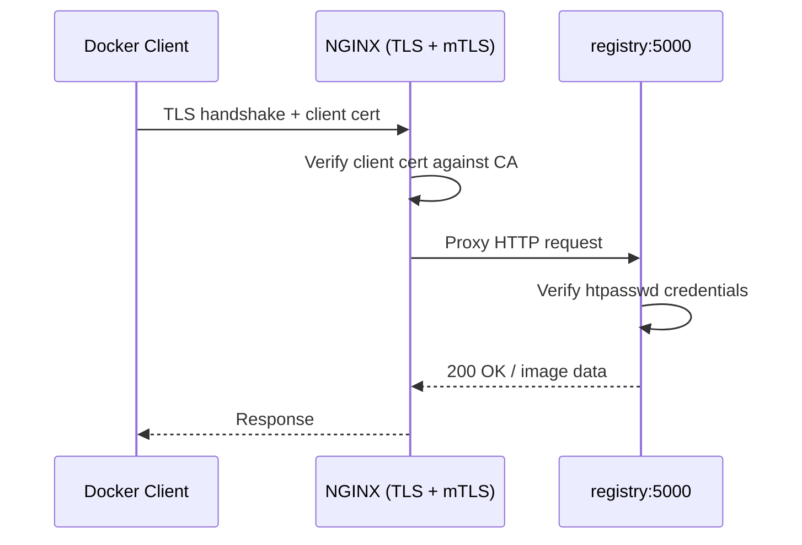

Public container registries like Docker Hub and GitHub Container Registry are
convenient, but there are good reasons to run your own. Maybe you want full
control over where your images live. Maybe you are running services on a home
server and would rather not push proprietary application images to a third
party. Or perhaps you simply want to understand how the registry protocol works
beneath the surface of `docker push`.

This article walks through setting up a private Docker container registry from
scratch, fronted by NGINX for TLS termination, secured with `htpasswd`
credentials, and locked down with mutual TLS (mTLS) so that only machines
holding a valid client certificate can connect at all. By the end, you will have
a working registry that you can push to and pull from, with two layers of
authentication protecting it.

## What We Are Building

The architecture is straightforward. NGINX sits in front of the registry and
handles TLS termination, so the registry itself runs plain HTTP internally. When
a Docker client connects, NGINX first verifies the client's TLS certificate
against a private certificate authority. If the certificate is valid, the
request is forwarded to the registry, which then checks `htpasswd` credentials
via HTTP Basic Auth. Both checks must pass before any image data moves.



## Prerequisites

You will need Docker and Docker Compose installed on the machine that will host
the registry. You also need a domain name pointing to that machine with a valid
TLS certificate for NGINX. If you are running this on a home server behind a
router, you will need to forward ports 80 and 443 to the host. This guide
assumes you already have TLS certificates in hand (from Let's Encrypt or
otherwise) and focuses on the registry and mTLS setup.

You will also need `openssl` installed on your machine to generate the CA and
client certificates. It ships with most Linux distributions and macOS.

## Setting Up the Registry

### Project Structure

Start with a clean directory. By the end of this section, the layout will look
like this:

```
registry-server/
├── bin/
│   └── registry-entrypoint
├── nginx/
│   └── registry.conf
├── pki/
│   └── mtls/
│       ├── ca/
│       └── clients/
├── registry/
│   └── data/
├── docker-compose.yml
└── .env
```

### Docker Compose

The compose file defines two services. The registry runs the official
`registry:latest` image with `htpasswd` authentication enabled via environment
variables. NGINX sits in front and proxies HTTPS traffic to the registry's
internal HTTP port.

```yaml
services:
  registry:
    image: registry:latest
    container_name: registry
    restart: always
    env_file:
      - .env
    environment:
      REGISTRY_AUTH: htpasswd
      REGISTRY_AUTH_HTPASSWD_REALM: Registry Realm
      REGISTRY_AUTH_HTPASSWD_PATH: /auth/registry.password
      REGISTRY_STORAGE_FILESYSTEM_ROOTDIRECTORY: /data
    volumes:
      - ./registry/data:/data
      - ./bin/registry-entrypoint:/registry-entrypoint:ro
    entrypoint: ["/bin/sh", "/registry-entrypoint"]
    ports:
      - "5000"

  nginx:
    image: nginx:latest
    container_name: nginx
    restart: always
    depends_on:
      - registry
    ports:
      - "443:443"
    volumes:
      - ./nginx/registry.conf:/etc/nginx/conf.d/default.conf:ro
      - ./certs:/etc/nginx/certs:ro
      - ./pki/mtls/ca/ca.crt:/etc/nginx/mtls/ca.crt:ro
```

The registry does not expose any ports to the host directly. Only NGINX is
reachable from the outside, and only on port 443.

### Registry Credentials

The registry image uses `htpasswd` files for authentication, but it does not
ship with the `htpasswd` binary. Rather than baking credentials into an image at
build time, we use an entrypoint script that installs the utility and generates
the password file from environment variables at startup. This keeps credentials
out of your image layers and lets you manage them through a `.env` file.

```ini
REGISTRY_USER=deployer
REGISTRY_PASSWORD=your-strong-password-here
```

The entrypoint script reads these variables and creates the `htpasswd` file
before handing off to the registry's default entrypoint.

```bash
#!/usr/bin/env bash

set -euo pipefail

if [ -z "${REGISTRY_USER:-}" ] || [ -z "${REGISTRY_PASSWORD:-}" ]; then
    echo "ERROR: REGISTRY_USER and REGISTRY_PASSWORD must be set"
    exit 1
fi

apk add --no-cache apache2-utils > /dev/null 2>&1

mkdir -p /auth
htpasswd -Bbn "$REGISTRY_USER" "$REGISTRY_PASSWORD" > /auth/registry.password

exec /entrypoint.sh /etc/distribution/config.yml
```

Make it executable.

```sh
chmod +x bin/registry-entrypoint
```

A couple of details worth noting here. The `registry:latest` image is
Alpine-based, so `apk` is the package manager. The `-Bbn` flags tell `htpasswd`
to use `bcrypt` hashing (`-B`), run in batch mode (`-b`), and write to stdout
(`-n`) which we redirect to the file. The final `exec` replaces the shell
process with the actual registry binary, so signals like SIGTERM are forwarded
correctly when Docker stops the container.

### NGINX Configuration

The NGINX configuration proxies HTTPS traffic to the registry. Replace
`registry.example.com` with your actual domain and adjust the certificate paths
to match your setup.

```nginx
server {
    listen 443 ssl;
    listen [::]:443 ssl;
    http2 on;
    server_name registry.example.com;

    ssl_certificate /etc/nginx/certs/fullchain.pem;
    ssl_certificate_key /etc/nginx/certs/privkey.pem;
    ssl_protocols TLSv1.2 TLSv1.3;

    # mTLS: require a valid client certificate
    ssl_client_certificate /etc/nginx/mtls/ca.crt;
    ssl_verify_client on;

    # Container images can be large
    client_max_body_size 2g;

    location / {
        proxy_pass http://registry:5000;
        proxy_set_header Host $http_host;
        proxy_set_header X-Real-IP $remote_addr;
        proxy_set_header X-Forwarded-For $proxy_add_x_forwarded_for;
        proxy_set_header X-Forwarded-Proto $scheme;
        proxy_read_timeout 900;
    }
}
```

The `client_max_body_size 2g` directive is important. Container images are
transferred as compressed layers, and individual layers can be hundreds of
megabytes. Without this directive, NGINX defaults to a `1MB` body limit and will
reject most pushes with a `413 Request Entity Too Large` error.

The `proxy_read_timeout 900` gives the registry 15 minutes to respond, which
accommodates large layer uploads on slow connections.

## Building the mTLS Layer

Mutual TLS adds a second dimension to the TLS handshake. In standard TLS, only
the server presents a certificate and the client verifies it. In mTLS, the
client also presents a certificate, and the server verifies it against a trusted
certificate authority. If the client cannot produce a valid certificate, the
connection is refused before any HTTP traffic is exchanged.

This is a fundamentally different security boundary from `htpasswd`. Credentials
can be phished, leaked, or brute-forced. A client certificate is a cryptographic
proof tied to a private key that never leaves the machine. An attacker would
need physical or root access to the machine to extract it.

### Creating a Private Certificate Authority

The CA is the root of trust for the entire mTLS setup. Any client certificate
signed by this CA will be accepted by NGINX. Keep the CA private key secure
since anyone with access to it can mint new client certificates.

```sh
mkdir -p pki/mtls/ca

# Generate the CA private key (4096-bit RSA)
openssl genrsa -out pki/mtls/ca/ca.key 4096

# Generate the CA certificate (valid for 10 years)
openssl req -new -x509 -days 3650 \
    -key pki/mtls/ca/ca.key \
    -out pki/mtls/ca/ca.crt \
    -subj "/CN=Registry mTLS CA/O=example.com"
```

The 10-year validity is intentional. Rotating a CA means re-issuing every client
certificate it has signed, so a long lifetime avoids unnecessary churn for an
internal-only CA. This is different from server certificates where short
lifetimes (90 days with Let's Encrypt) are standard practice, because server
certificates are tied to public domain identity and subject to revocation list
checking.

### Generating Client Certificates

Each machine that needs access to the registry gets its own client certificate,
signed by the CA. This gives you fine-grained control. If a machine is
compromised, you revoke that one certificate without affecting others.

```sh
CLIENT_NAME="desktop"
CLIENT_DIR="pki/mtls/clients/$CLIENT_NAME"
mkdir -p "$CLIENT_DIR"

# Generate client private key
openssl genrsa -out "$CLIENT_DIR/client.key" 4096

# Generate a certificate signing request
openssl req -new \
    -key "$CLIENT_DIR/client.key" \
    -out "$CLIENT_DIR/client.csr" \
    -subj "/CN=$CLIENT_NAME/O=example.com"

# Sign it with the CA
openssl x509 -req -days 3650 \
    -in "$CLIENT_DIR/client.csr" \
    -CA pki/mtls/ca/ca.crt \
    -CAkey pki/mtls/ca/ca.key \
    -CAcreateserial \
    -out "$CLIENT_DIR/client.cert"

# Clean up the CSR
rm "$CLIENT_DIR/client.csr"
```

Repeat this for every machine that needs registry access, changing the
`CLIENT_NAME` each time.

### Installing Client Certificates for Docker

Docker looks for client certificates in a specific directory structure. On Linux
with the native Docker Engine, this is `/etc/docker/certs.d/`. The directory
name must match the registry hostname exactly.

```sh
REGISTRY_HOST="registry.example.com"

sudo mkdir -p "/etc/docker/certs.d/$REGISTRY_HOST"
sudo cp pki/mtls/ca/ca.crt "/etc/docker/certs.d/$REGISTRY_HOST/ca.crt"
sudo cp pki/mtls/clients/desktop/client.cert "/etc/docker/certs.d/$REGISTRY_HOST/client.cert"
sudo cp pki/mtls/clients/desktop/client.key "/etc/docker/certs.d/$REGISTRY_HOST/client.key"
```

Docker reads these automatically whenever it connects to that registry. No
daemon restart is required, and no configuration file changes are needed. The
file naming matters: the CA certificate must be `ca.crt`, the client certificate
must end in `.cert` (not `.crt`), and the key must end in `.key`.

### Docker Desktop on Linux

If you are running Docker Desktop on Linux rather than the native Docker Engine,
there is an additional step. Docker Desktop runs its daemon inside a `LinuxKit`
virtual machine, which has its own isolated filesystem. The host's
`/etc/docker/certs.d/` is not visible inside the VM, so the daemon never sees
your client certificates.

The symptom is a `400 Bad Request` with the message "No required SSL certificate
was sent", even though the certificates are correctly installed on the host. You
can confirm this by testing with `curl` directly (which uses the host filesystem
and works fine) while `docker login` fails.

The fix is to copy the certificates into the VM's filesystem using `nsenter`:

```sh
REGISTRY_HOST="registry.example.com"
HOST_CERT_DIR="/host_mnt/etc/docker/certs.d/$REGISTRY_HOST"
VM_CERT_DIR="/etc/docker/certs.d/$REGISTRY_HOST"

docker run --rm --privileged --pid=host alpine \
    nsenter -t 1 -m -- sh -c \
    "mkdir -p $VM_CERT_DIR && cp $HOST_CERT_DIR/* $VM_CERT_DIR/"
```

This runs a privileged Alpine container that enters the VM's mount namespace via
`nsenter` and copies the certs from the host mount (accessible at `/host_mnt/`
inside the VM) into the VM's own `/etc/docker/certs.d/`. The certs are now
visible to the Docker daemon running inside the VM.

The caveat is that the VM's filesystem is ephemeral. These certificates will be
lost whenever Docker Desktop restarts. You will need to re-run the command after
each restart. Wrapping it in a script is the pragmatic solution.

## Testing the Setup

### Starting the Services

```sh
docker compose up -d
```

### Verifying mTLS with curl

Before involving Docker, verify that the mTLS handshake works using `curl`. This
isolates the TLS layer from Docker's credential handling.

```sh
# Without a client cert (should get 400)
curl -s https://registry.example.com/v2/

# With a client cert (should get 401, meaning mTLS passed)
CERT_DIR="/etc/docker/certs.d/registry.example.com"
curl -s \
    --cert $CERT_DIR/client.cert \
    --key $CERT_DIR/client.key \
    --cacert $CERT_DIR/ca.crt \
    https://registry.example.com/v2/
```

A `400` response means NGINX rejected the connection because no client
certificate was presented. A `401` response means mTLS succeeded, and the
registry is asking for `htpasswd` credentials. Both are correct behaviour at
their respective stages.

### Logging In

```sh
docker login registry.example.com
```

Docker will prompt for your username and password (the values from your `.env`
file). A successful login stores the credentials in `~/.docker/config.json`, so
you do not need to re-enter them for subsequent push and pull operations.

### Building and Pushing a Test Image

Create a minimal Dockerfile to test the full round trip.

```dockerfile
# Dockerfile.test
FROM alpine:latest
RUN echo "registry test image" > /hello.txt
CMD ["cat", "/hello.txt"]
```

Build it, tag it for your registry, and push it.

```sh
docker build -f Dockerfile.test -t registry.example.com/test/hello:v1 .
docker push registry.example.com/test/hello:v1
```

### Verifying the Push

Query the registry API to confirm the image landed. To avoid repeating the mTLS
flags on every curl invocation, set up a few variables first.

```sh
CERT_DIR="/etc/docker/certs.d/registry.example.com"
CURL_MTLS="--cert $CERT_DIR/client.cert --key $CERT_DIR/client.key --cacert $CERT_DIR/ca.crt"

# List all repositories
curl -s -u deployer:your-password $CURL_MTLS \
    https://registry.example.com/v2/_catalog

# List tags for the test image
curl -s -u deployer:your-password $CURL_MTLS \
    https://registry.example.com/v2/test/hello/tags/list
```

### Pulling the Image Back

Delete the local copy and pull it from the registry to verify the full cycle.

```sh
docker rmi registry.example.com/test/hello:v1
docker pull registry.example.com/test/hello:v1
docker run --rm registry.example.com/test/hello:v1
```

The output should print `registry test image`.

## Security Considerations

The two authentication layers serve different purposes and protect against
different threats. mTLS operates at the transport layer and prevents
unauthorized machines from establishing a connection at all. Without a valid
client certificate, NGINX terminates the TLS handshake before any HTTP request
is processed. This is your perimeter defence.

The `htpasswd` layer operates at the application level and controls who can
perform specific actions (push, pull, catalogue listing) once a connection is
established. A stolen client certificate alone is not sufficient to access
images because the attacker still needs valid credentials.

The CA private key is the critical asset in this setup. Anyone who obtains it
can sign new client certificates and bypass the mTLS check entirely. Store it on
a machine you control, restrict file permissions to your user, and do not commit
it to version control. If you suspect the CA key has been compromised, generate
a new CA, re-issue all client certificates, and replace the CA cert in your
NGINX configuration.

The `.env` file containing registry credentials should also be excluded from
version control. Add both to your `.gitignore`:

```sh
.env
pki/
registry/data/
```

## Wrapping Up

Running a private registry is more accessible than it might seem. The official
Docker registry image handles the hard parts (content-addressable storage, the
distribution API, garbage collection), and NGINX provides a battle-tested
reverse proxy for TLS termination. Adding mTLS on top turns a simple
password-protected registry into something that is genuinely difficult to access
without physical control of an authorised machine.

The setup described here runs comfortably on a Raspberry Pi or any small VPS.
The registry itself is lightweight, and NGINX adds negligible overhead. The main
resource consideration is disk space for stored image layers, which accumulates
over time if you are pushing frequently. The registry supports garbage
collection for cleaning up unreferenced layers, which is worth configuring if
storage is constrained.
